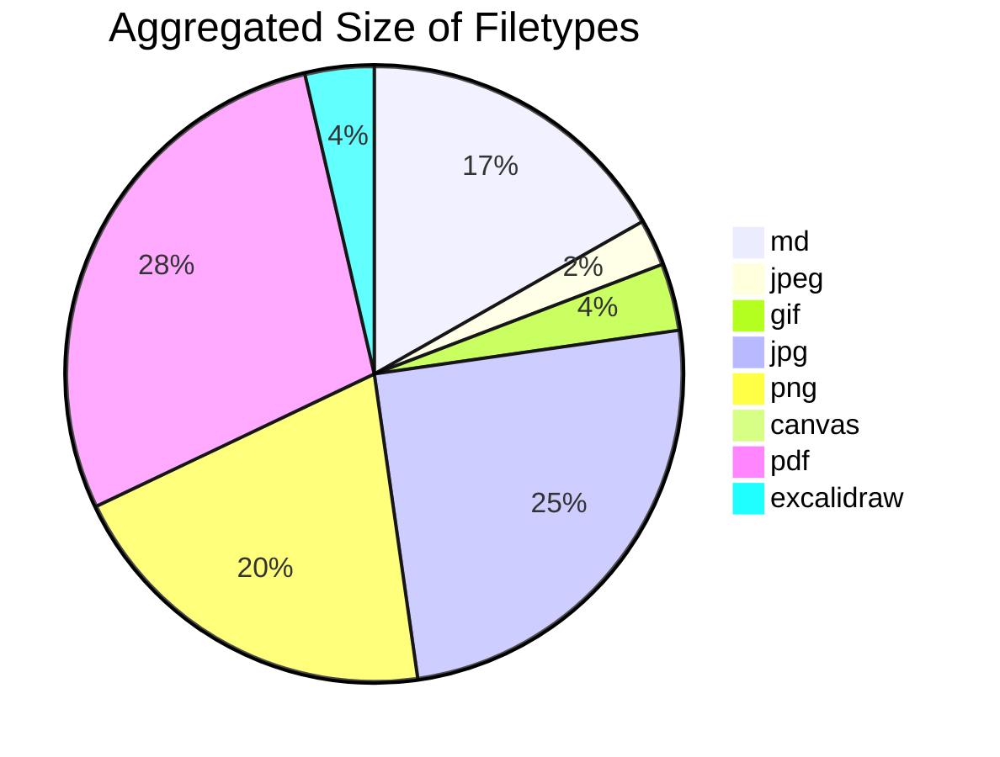
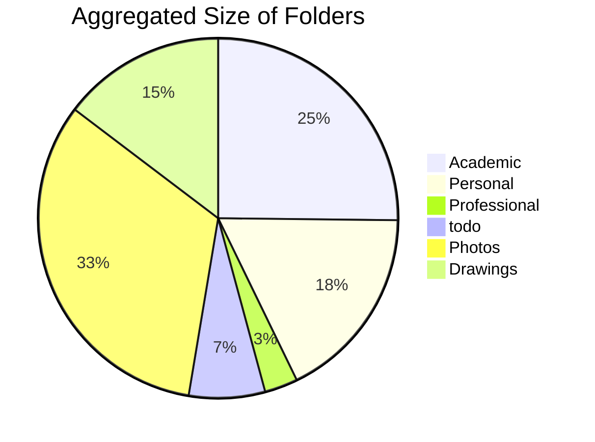
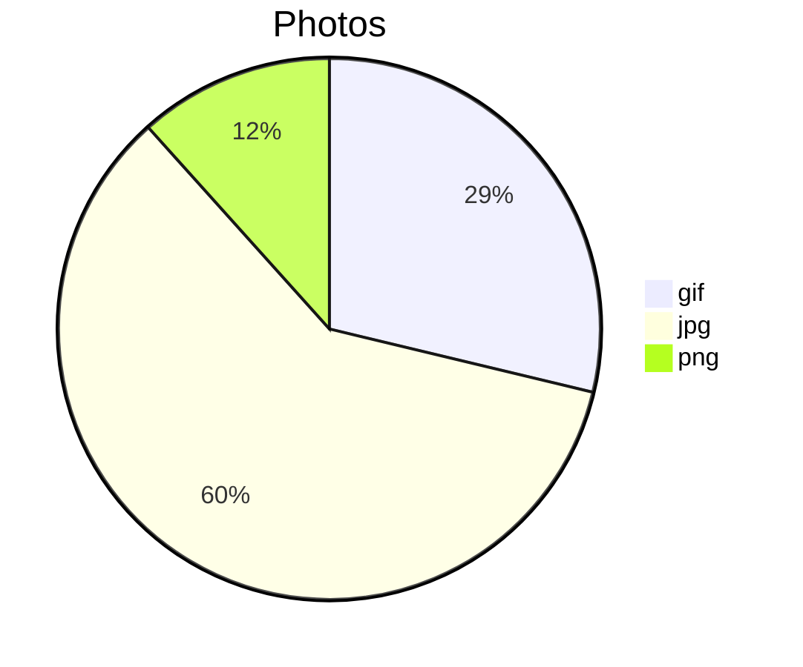
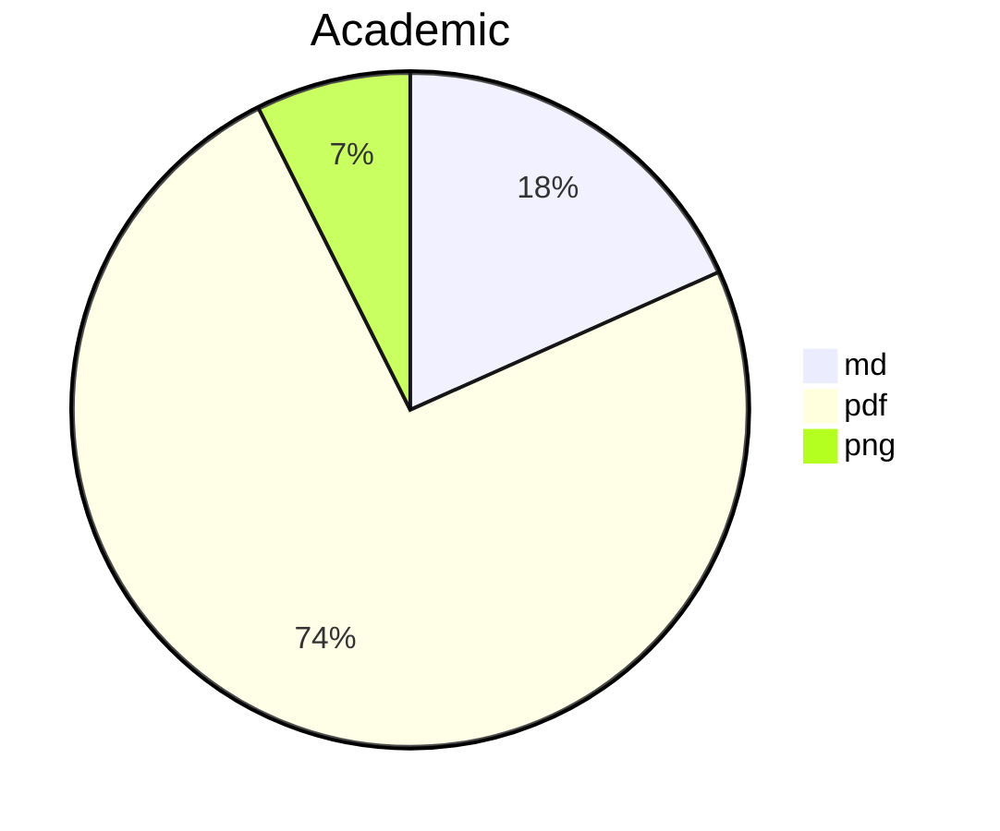
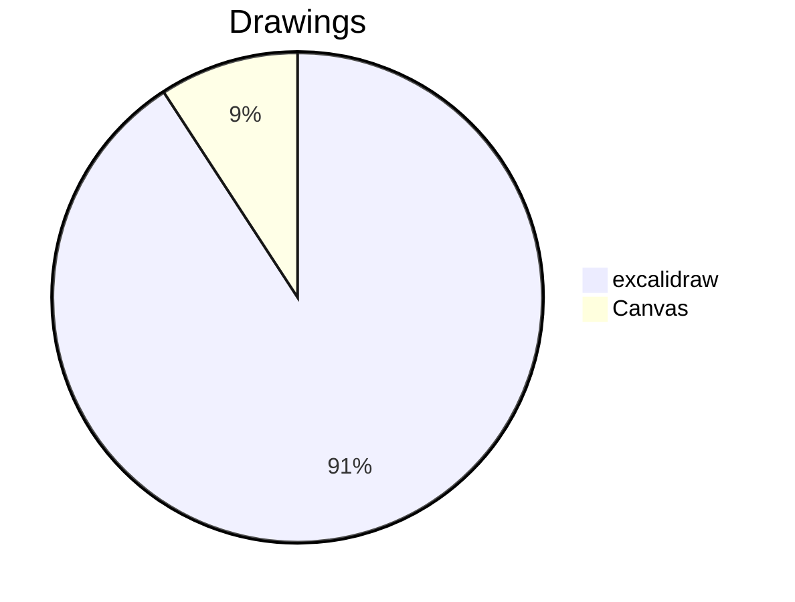

NOTE: I only realized half way in developing this that the size of a file and the disk space it takes up are very different things. Though they are related, I did not consider the metadata of files and directories, such as permissions, modification dates, owners, groups, etc. that you operating system, not Obisidian, takes into account. This will differ across Windows, Linux, and MacOS. Through the use of Obsidian's API alone, only the size of files can be measured, not the actual disk space. So I am considering changing the name. Despite all this, an aggregated count of file sizes of your entire vault, broken down by folders and filetypes is still very handy and comparing the readings to my Linux du (Disk Usage) command, they seemed proportianally accurate. Also keep in mind this does NOT account for the hidden .obsidian folder which contains all your plugins. This folder usually takes up quite alot of space the more plugins you have downloaded. 

This plugin is currently in early development. It's purpose is simple, to manage the file space and size of your vault. Whether you want to know which folder is slowing your loading speed, or you are reaching your size limit for the sync service, this plugin will be helpful in managing your vault.

### Features

##### Show Summary of Vault

#### View Total Size of Each File Type and Folder

#### Size of File Type by Folders

### How To Use

After installing and enabling this plugin, you will find a `Disk Usage Report` ribbon icon/button on the left of the screen. This will create a markdown file with all the graphs you see above. Once done, you can either save it somewhere or delete it. 

If this plugin doesn't work for some reason, or there is a bug, please email me at jbulfer13@gmail.com or add an issue to the [Github Repo](https://github.com/Promptier/disk-usage/issues). Thanks.
