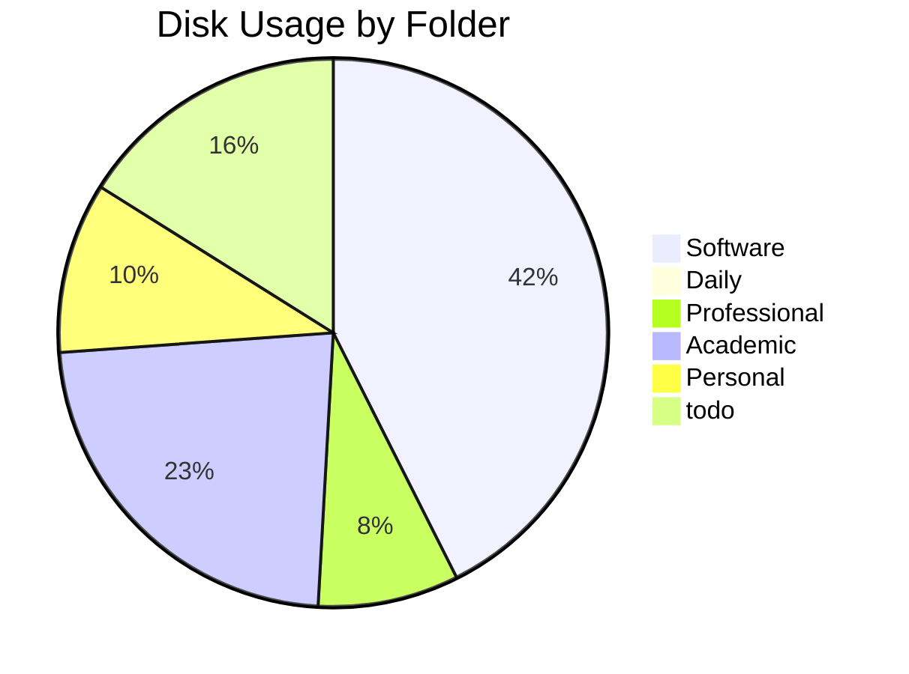
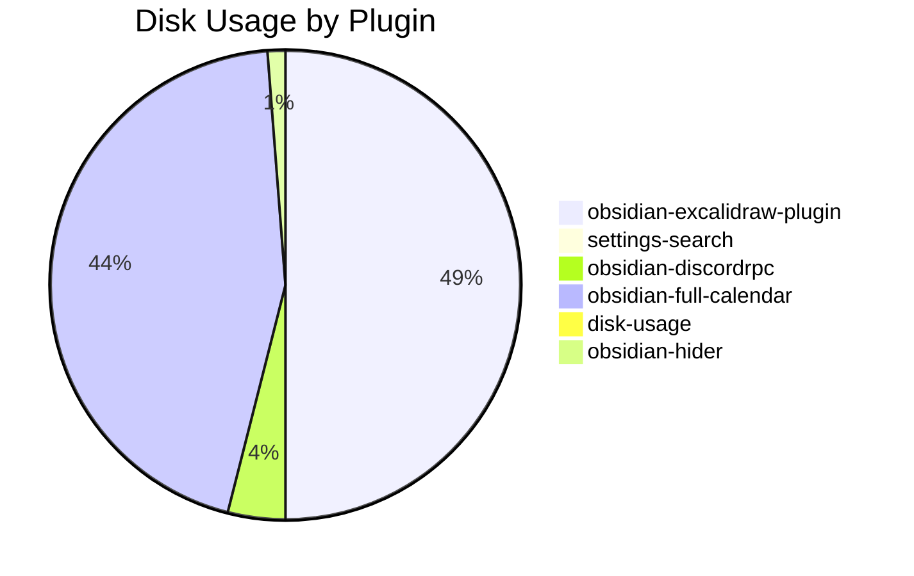
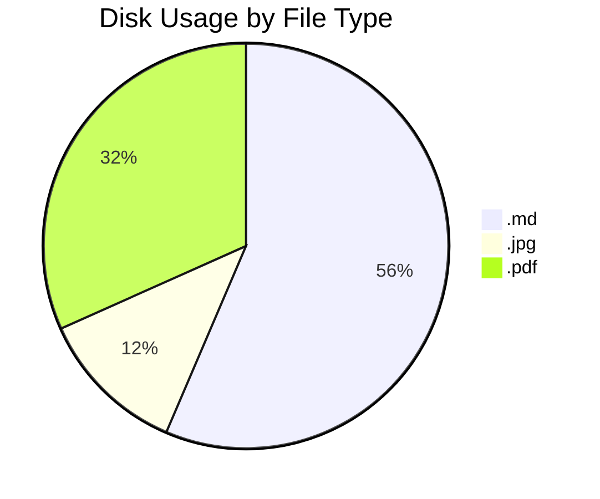

This plugin is currently in early development. It's purpose is simple, to manage the file space and size of your vault. Whether you want to know which folder is slowing your loading speed, or you are reaching your size limit for the sync service, this plugin will be helpful in managing your vault

### Features

##### Track Folders

##### Track Plugins

##### Track Filetypes

