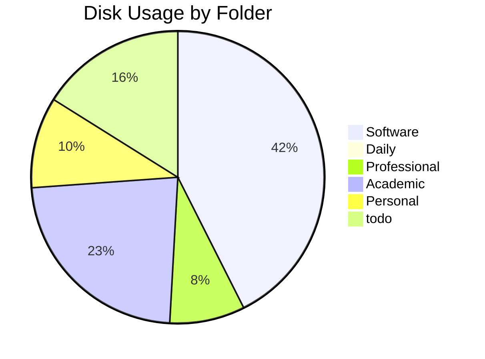
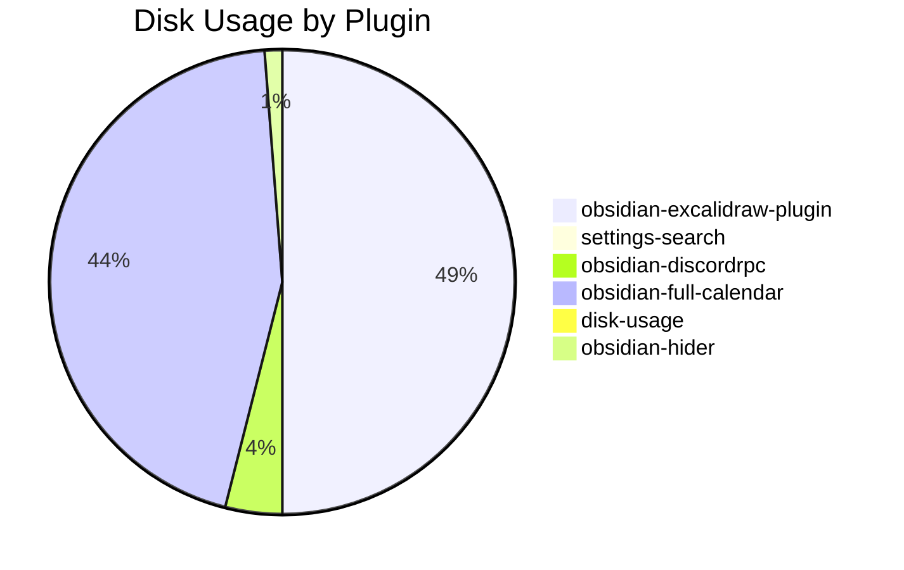
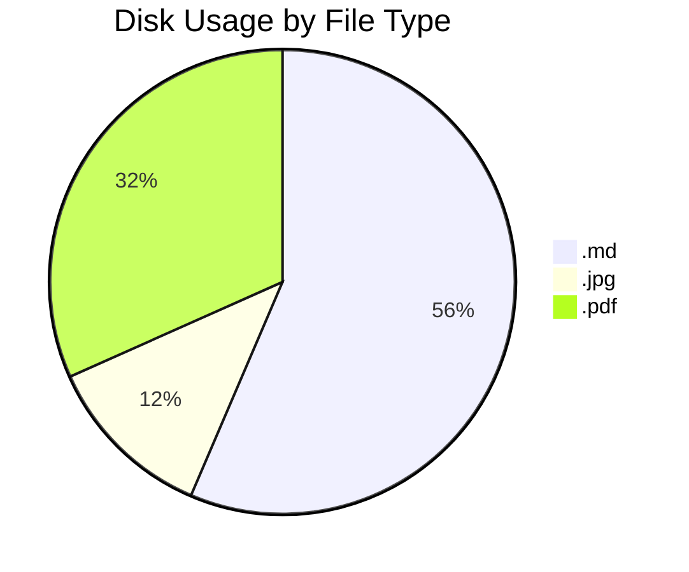

This plugin is currently in early development. It's purpose is simple, to manage the file space and size of your vault. Whether you want to know which folder is slowing your loading speed, or you are reaching your size limit for the sync service, this plugin will be helpful in managing your vault.

UPDATE: All the bash/shell scripts are now deprecated and I am now rewriting this is Typescript and using Obsidian's own API. I realized otherwise I would have to rewrite the scripts in Powershell for windows, and figure out some odd solution for mobile. Not to mention to security concerns of requiring `sudo` for the `du` (disk usage) command, which the bash scripts rely on. Using Obsidian's API and all their built in methods is the clear answer and is crossplatform in it's nature. Despite not longer needing the them, I will keep the bash scripts here for now becuase I think they are cool.

### Features

##### Track Folders

##### Track Plugins

##### Track Filetypes

